# AI Visual Editor

A desktop tool that takes an AI-generated image and prepares everything you need to publish it — signature, thumbnail frame, rating badge, censoring, custom texts — and, most importantly, **extracts the generation prompt into a clean, shareable `.txt`** with links to the models you used.

It was built to remove the repetitive work of posting AI art on galleries such as InkBunny, FurAffinity or DeviantArt, where every upload means re-doing the same handful of steps.

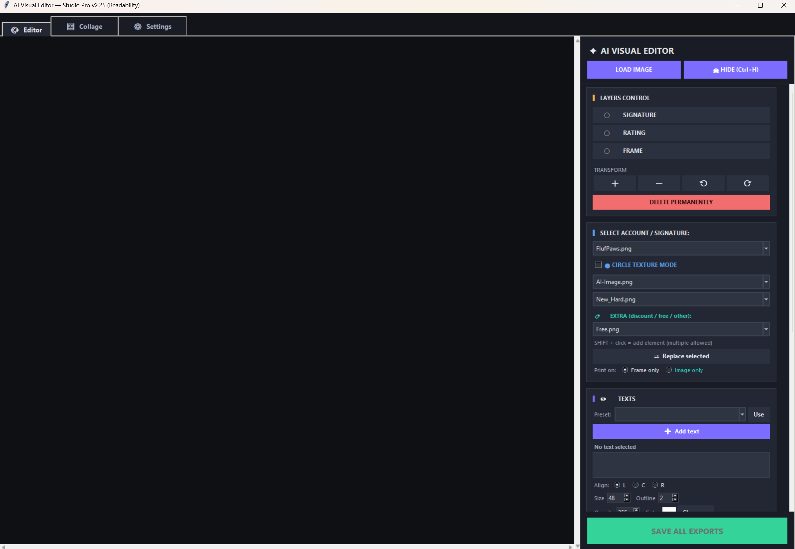

> **This is a personal project, shared as-is.** It does what its author needs it to do. Feel free to use it, fork it or adapt it — but there is no promise of support, roadmap or backwards compatibility.

---

## Table of contents

- [What it does](#what-it-does)
- [Requirements and installation](#requirements-and-installation)
- [Folder structure](#folder-structure)
- [Editor tab](#editor-tab)
- [Collage tab](#collage-tab)
- [Settings tab](#settings-tab)
- [Configuration text files](#configuration-text-files)
- [The generated prompt file](#the-generated-prompt-file)
- [Keyboard and mouse reference](#keyboard-and-mouse-reference)

---

## What it does

| | |
|---|---|
| **Prompt extraction** | Reads the metadata written by Stable Diffusion / Forge / SD.Next and produces a tidy `.txt`: positive prompt, negative prompt, parameters, models — with tags and LoRAs you want to keep private filtered out. |
| **Model links** | Adds a link under every model and LoRA. Civitai search by hash, or **your own URL** for models you host elsewhere. |
| **Signature** | Drops your signature PNG anywhere on the image. |
| **Frame / thumbnail** | Crops a square of the image into a decorated frame — the "preview" version for galleries. |
| **Rating badge** | A PNG badge placed inside the frame. |
| **Mosaic censoring** | Rectangle or free brush, with undo. |
| **Text layers** | Multiple movable texts with size, colour, outline, opacity, alignment and rotation. Reusable presets. |
| **Collage** | Several images into one file — automatic grid or free comic-style panels with slanted corners. |

Everything is **non-destructive**: the tool always works on a copy and never modifies your original image.

---

## Requirements and installation

- **Python 3.9+**
- **Pillow** — required
- **tkinterdnd2** — optional, adds drag & drop of files onto the canvas

```bash
pip install pillow
pip install tkinterdnd2   # optional
```

```bash
python processore_immagini.py
```

Tkinter ships with Python on Windows and macOS. On Linux you may need `sudo apt install python3-tk`.

All working folders are created automatically the first time you run the program.

---

## Folder structure

The tool reads its assets from folders next to the script. **They start out empty — you fill them with your own PNGs.**

| Folder | What goes in |
|---|---|
| `Firme/` | Your signatures, transparent PNG. The file name becomes the account name used in the output file names. |
| `Cornici/` | Frames / thumbnail borders, transparent PNG. |
| `Cornici_Mask/` | Frames for *Circle Texture Mode* (see below). |
| `Maschere/` | Black-and-white masks for *Circle Texture Mode*. |
| `Rating/` | Rating badges, transparent PNG. |
| `Extra/` | Any extra badge — "free", "discount", watermarks… |
| `Layouts/` | Saved collage layouts (created by the program). |
| `Lang/` | Interface translations. |
| `Output_Pubblicazione/` | Everything the tool exports. |

---

## Editor tab

### Loading an image

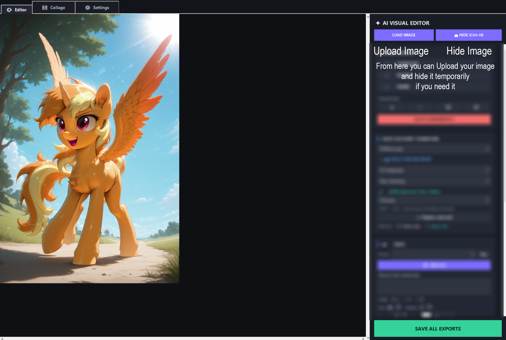

**LOAD IMAGE** opens a PNG, JPG, WEBP or BMP — or just drag the file onto the canvas if `tkinterdnd2` is installed.

**HIDE (Ctrl+H)** blanks the preview instantly. Handy when you are working on something you would rather not have on screen while someone walks past.

Both buttons stay pinned at the top of the panel, and **SAVE ALL EXPORTS** stays pinned at the bottom, so they are always reachable no matter how far you scroll.

### Signature

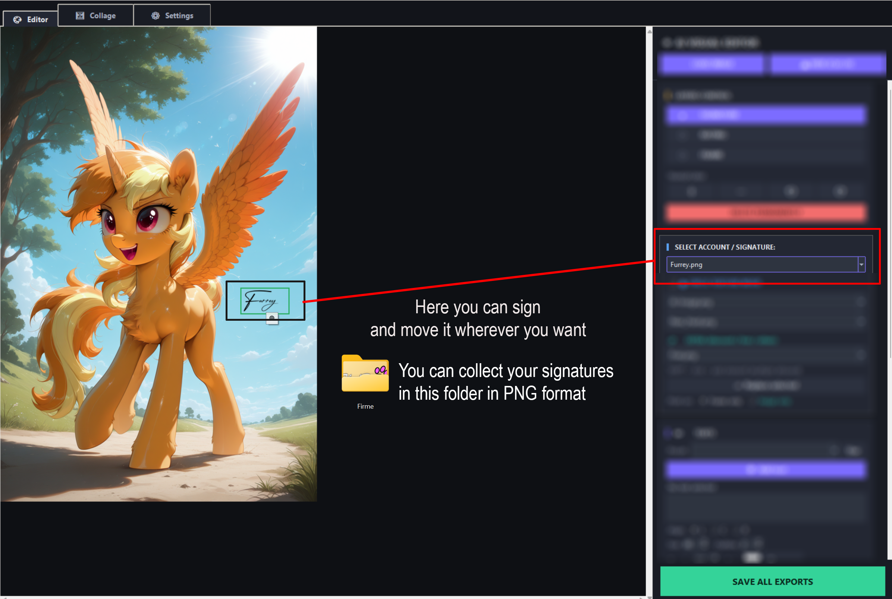

Pick a signature from the dropdown, then **right-click** on the canvas to place it. Drag it to move it, and use the **+ − ⟲ ⟳** buttons in *Layers Control* to resize and rotate.

The signature name is also appended to the exported file name, which makes it easy to keep versions for different accounts side by side.

### Frame (thumbnail)

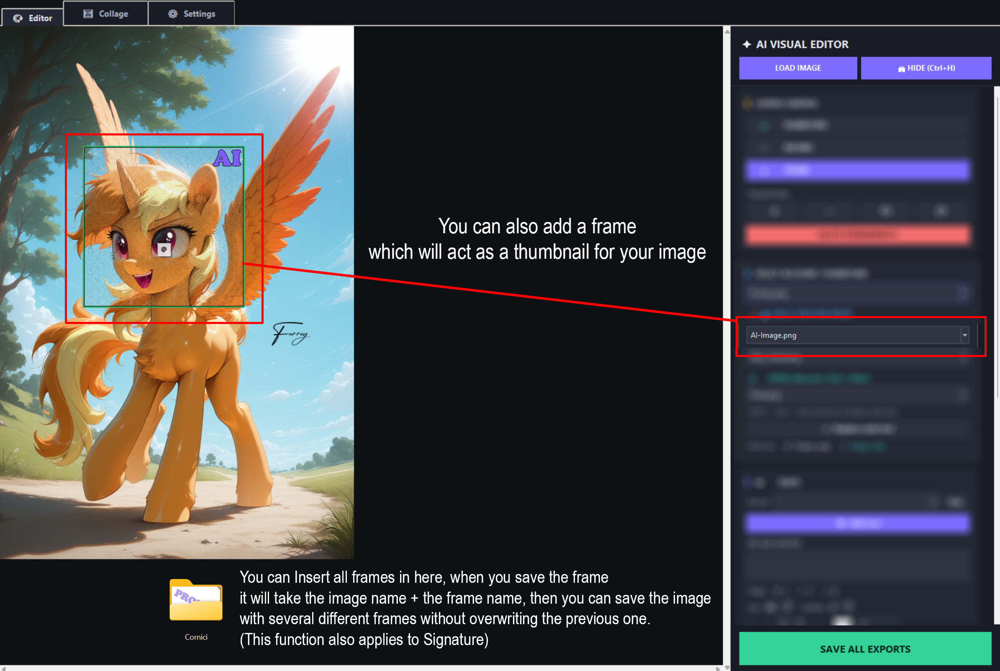

**Left-click and drag** on the canvas to draw a square: that area becomes a separate, framed image — the thumbnail you post as a preview.

The exported frame file is named `original_name + frame_name`, so you can export the same image with several different frames without overwriting anything.

### Circle Texture Mode — frames of any shape

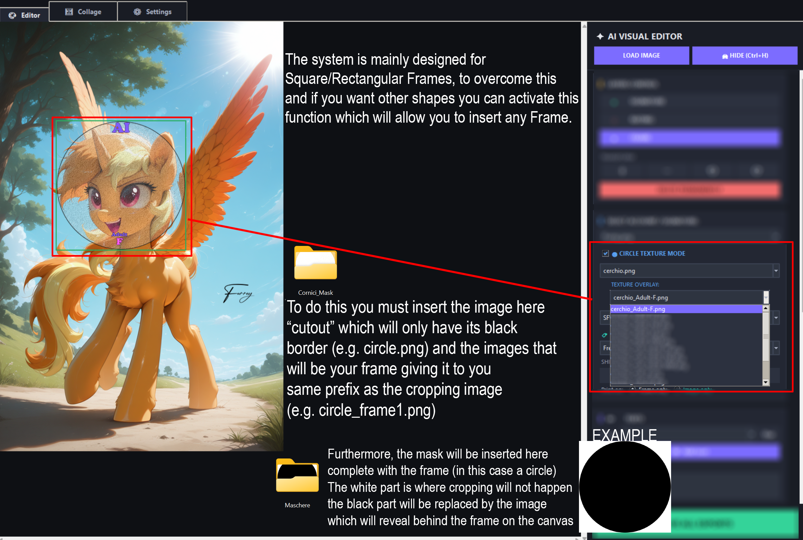

The frame system is built around squares and rectangles. If you want a circle, a hexagon or any other shape, enable **Circle Texture Mode**, which then reads from `Cornici_Mask/` and `Maschere/`:

- In **`Cornici_Mask/`** put the *cutout* — a PNG containing only the border of the shape, e.g. `cerchio.png` — plus the textures/overlays that share its prefix, e.g. `cerchio_Adult-F.png`. The dropdown filters overlays by prefix automatically.
- In **`Maschere/`** put the black-and-white mask with the same prefix, e.g. `cerchio.png`. **Black is where your image shows through; white is left out.**

The exported frame is a PNG with transparency instead of a JPG.

> **The circular mask shipped with this repository is reusable.** The program takes the frame's
> name, cuts it at the first `_` and looks for a mask with that prefix. So every overlay you name
> `cerchio_something.png` automatically reuses `Maschere/cerchio.png` — you can design as many
> circular frames as you like without ever creating a mask.
>
> If a mask is missing, the tool falls back to an ellipse that fills the frame, so round shapes
> keep working anyway. The mask is what makes **non-elliptical** shapes possible — hexagons,
> hearts, stars — so keep it around, or add your own with a new prefix.

### Rating

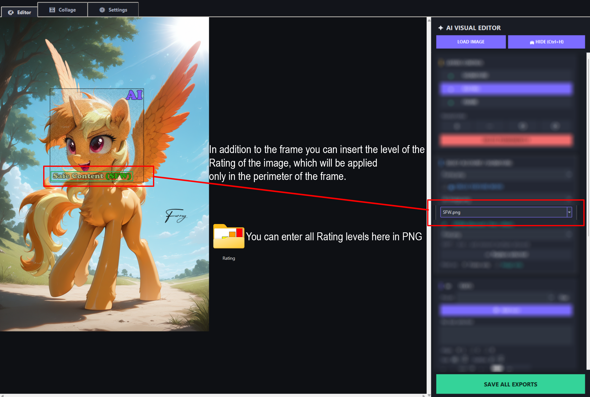

**Middle-click** inside the frame to place a rating badge. It is printed **only inside the frame**, not on the full image.

### Extra elements

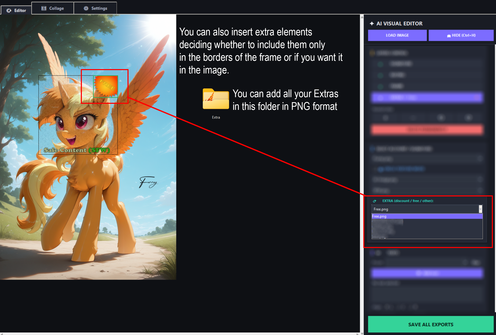

**SHIFT + left-click** adds an extra badge. You can add **as many as you like** — each one is moved, resized, rotated, hidden or deleted independently, and they all appear as separate rows in *Layers Control*.

**Print on** decides where they all end up: `Frame only` or `Image only`.

*Replace selected* swaps the artwork of the element you have selected, keeping its position and size.

### Text layers

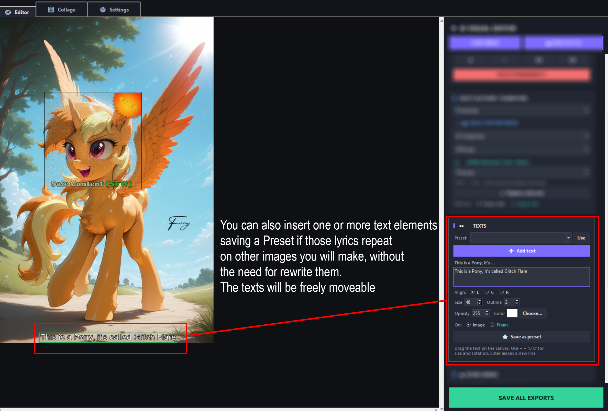

**Add text** creates a movable text layer. For each one you control:

- **Content** — a real multi-line box, Enter starts a new line
- **Align** — left, centre, right
- **Size**, **Outline** (a dark stroke that keeps text readable on any background), **Opacity**, **Colour**
- **Rotation** — with the ⟲ ⟳ buttons
- **On: Image / Frame** — chosen *per text*, so one caption can go on the full picture and another inside the thumbnail

**Save as preset** stores the text and its whole style under a name; the **Preset** dropdown then recreates it in one click on any future image. Ideal if you always add the same caption or watermark.

### Mosaic censoring

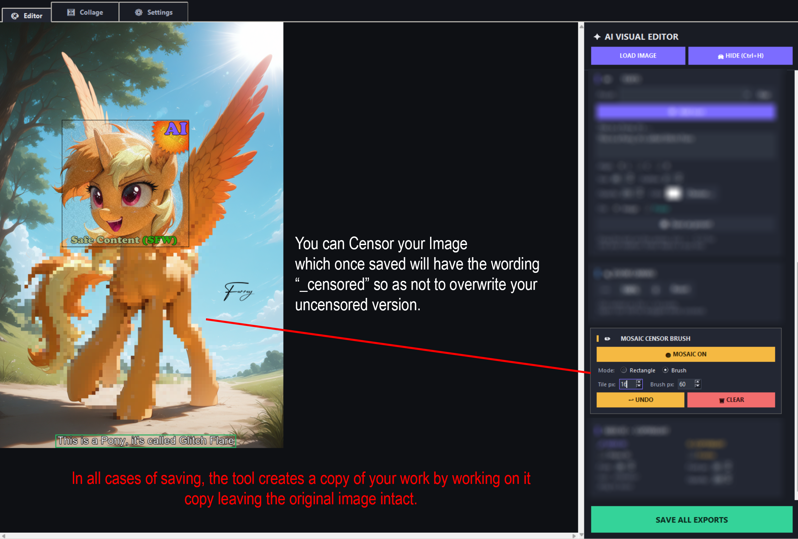

Turn **MOSAIC ON** and choose the mode:

- **Rectangle** — drag a box
- **Brush** — paint freely, in real time

`Tile px` sets how coarse the mosaic is, `Brush px` the brush size. **UNDO** removes the last stroke, **CLEAR** restores the untouched image.

Censored exports get `_censored` added to the file name, so your uncensored version is never overwritten.

### Seed ID and Copyright

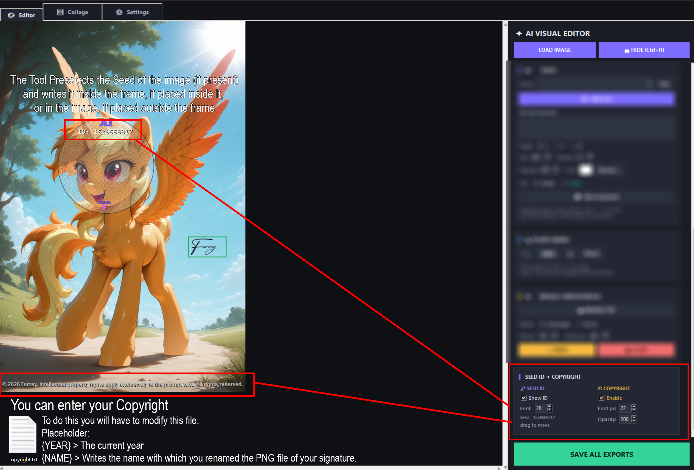

**Seed ID** reads the seed from the image metadata and prints it as a movable label. Drag it inside the frame and it is printed on the frame; leave it outside and it goes on the full image. If the image has no seed, a manual ID field appears and that ID is also added to the file name.

**Copyright** prints a line at the bottom left, with adjustable size and opacity. The text comes from `copyright.txt` and understands three placeholders:

| Placeholder | Becomes |
|---|---|
| `{NAME}` | the name of the signature PNG you selected |
| `{YEAR}` | the current year |
| `{DATE}` | the current date |

### Saving

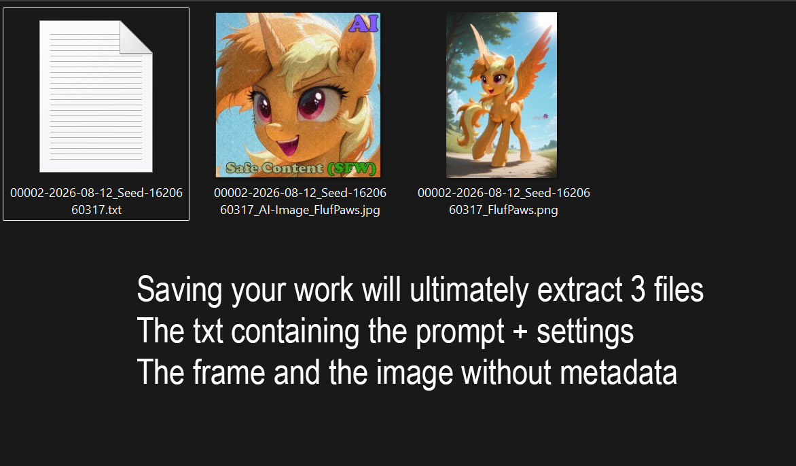

**SAVE ALL EXPORTS** writes up to three files into `Output_Pubblicazione/`:

| File | Contents |
|---|---|
| `name[_censored][_ID]_account.png` | the full image with signature, texts and copyright — **metadata stripped** |
| `name_frame_account.jpg` | the framed thumbnail (`.png` in Circle Texture Mode) |
| `name.txt` | the cleaned-up prompt and settings |

---

## Collage tab

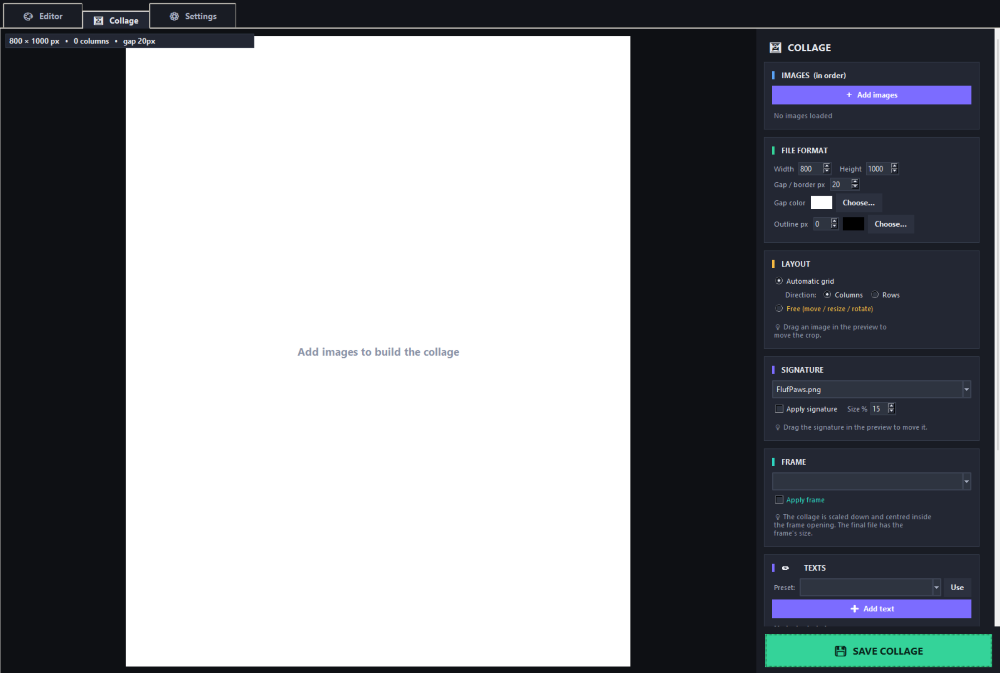

### Images

**Add images** loads as many as you want. The list keeps the order — use ↑ ↓ to rearrange and ✕ to remove. That order is also the order in which the prompts are numbered in the text file.

### File format

Set **Width** and **Height** of the final file, the **Gap / border** in pixels and its **colour**, plus an optional **Outline** drawn around each panel.

The outline sits **inside** the panel, right at the edge of the photo, so the gap between panels stays exactly the width you asked for. The result reads as `gap │ outline │ image │ outline │ gap`.

### Layout

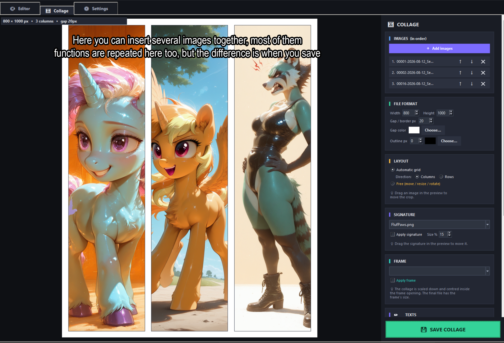

**Automatic grid** splits the page evenly — one cell per image — either as **Columns** side by side or **Rows** stacked.

**Free (move / resize / rotate)** turns every panel into a quadrilateral with four independent corners, which is how you get comic-style slanted panels:

| Action | Result |
|---|---|
| Drag a **corner** | moves that corner alone — this is what creates trapezoids and tilted panels |
| **SHIFT + corner** | classic rectangular resize, the opposite corner stays put |
| Drag **inside** a panel | moves the whole panel |
| **CTRL + drag** | moves the photo *inside* the panel, to choose what is visible |
| **⟲ ⟳** | rotates the panel by the step you set |
| **Straighten** | turns a distorted panel back into a rectangle |
| **Reset to columns** | rebuilds the default grid |

The image is **cropped** by the shape, never stretched.

**Uniform borders, automatically.** Do not try to leave equal gaps by hand: make the panels **touch each other**, and the tool creates the white space by shrinking each shape by half the gap. Two touching panels therefore end up exactly one gap apart — everywhere. **Snap corners and edges** makes them click together.

Layouts you like can be saved as **presets** and reapplied to any other set of images.

### Signature, Frame and Texts

The collage has its own **Signature** (drag it in the preview) and its own **Text** layers, sharing the same presets as the Editor.

**Frame** works differently here: the finished collage is **scaled down and centred inside the frame's opening**, which is detected automatically, and the final file takes the frame's size. Nothing is cropped.

### Saving

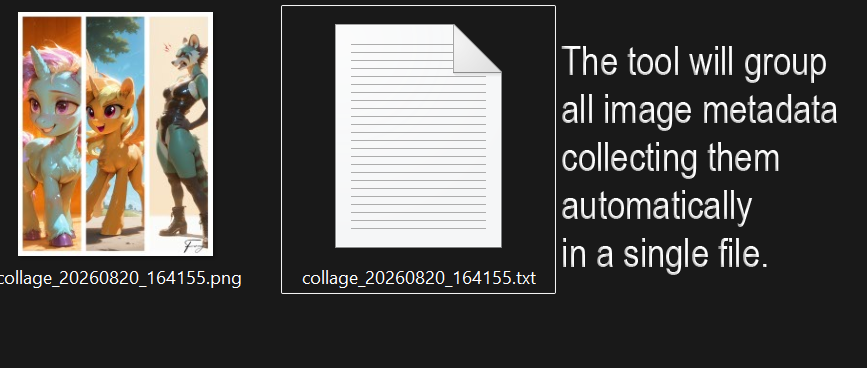

**SAVE COLLAGE** writes:

- `collage_<timestamp>.png` — the collage at the size you set
- `collage_<timestamp>_<frame>.png` — the framed version, if a frame is active
- `collage_<timestamp>.txt` — **all the prompts merged into one file**, numbered `#1`, `#2`, `#3`… in the same order as the images

---

## Settings tab

### Language

The interface ships in **English and Italian**. To add another language, copy a file from `Lang/`, rename it (`fr.json`, `de.json`…) and translate the values — it will appear in the dropdown by itself. Any key you leave out simply falls back.

### Saving options

| Option | Effect |
|---|---|
| **SD.Next** | parses the `sv_prompt` field used by SD.Next |
| **Metadata** | keeps the original metadata inside the exported PNG. ⚠️ When this is on, **the `.txt` prompt file is not created** — the data lives in the PNG instead |
| **Optimize PNG** | maximum compression, smaller files, slower saving |
| **Include RNG in parameters** | keeps the `RNG:` field in the exported parameters. It tells whether the initial noise was generated on CPU or GPU, which matters a lot to anyone trying to reproduce your generation. Off by default |

These are remembered between sessions.

### Model links

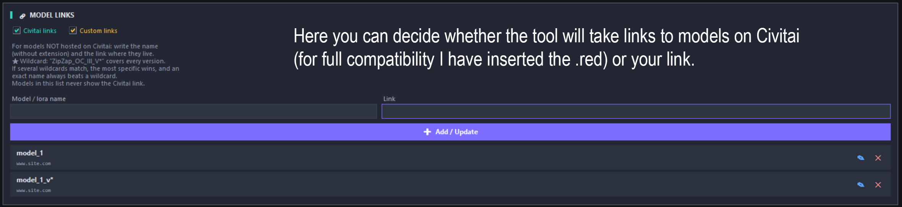

Two independent switches:

- **Civitai links** — adds a Civitai search link based on the model hash
- **Custom links** — uses your own URL for the models listed in the table below

For every model or LoRA that is **not** on Civitai, add its name and the page where it actually lives. Names are matched ignoring case and file extension.

**Wildcards.** `*` matches anything, `?` matches exactly one character:

```
ZipZap_OC_Ill_V*     →  covers V1, V2, V10, V2.5 …
ZipZap_OC_*_V*       →  covers every base name and every version
ZipZap_OC_Ill_V3     →  an exact name always wins over a wildcard
```

If several wildcards match, the most specific one wins. A model listed in this table never falls back to the Civitai link — being in the list *means* it is hosted somewhere else.

### Text presets

Every text preset you saved from the Editor or the Collage is listed here, with its colour, size and alignment. Rename with ✎, delete with ✕.

---

## Configuration text files

These plain-text files live next to the program and shape the exported `.txt`.

| File | What it does |
|---|---|
| **`footer_note.txt`** | Adds a block of text at the end of **every** `.txt` the tool generates. Supports `{NAME}`, `{DATE}`, `{YEAR}` and `{HOURS}`. Useful for commission info, links or usage terms. |
| **`ignore_loras.txt`** | One LoRA name per line. Any LoRA listed here is **left out** of the exported file — for private or unreleased LoRAs. |
| **`ignore_tags.txt`** | One tag per line. Every prompt tag is checked against this list and **excluded** if it matches. Lines starting with `#` are comments. |
| **`copyright.txt`** | The copyright line printed on the image. Supports `{NAME}`, `{DATE}`, `{YEAR}`. Keep it short — it is drawn on a single line. |

---

## The generated prompt file

```
Positive Prompt:
masterpiece, 1girl, best quality, detailed

Negative Prompt:
bad hands, blurry

Parameters:
Steps: 30, Sampler: DPM++ 2M, CFG scale: 7, Seed: 12345, Size: 512x768, Version: v1.7.0

Models:
Model: myCoolModel_v3 - Hash: 02273329cd
  https://civitai.red/search/models?sortBy=models_v9&query=02273329cd
lora: styleLora - Hash: abc123def4
  https://your-site.example/style-lora

------
Your footer note goes here.
```

Duplicated fields such as `Hires prompt` — which simply repeats the positive prompt — are removed automatically, as are the internal hash blocks.

---

## Keyboard and mouse reference

### Editor

| Input | Action |
|---|---|
| Left-click + drag on empty canvas | draw the frame |
| Left-click + drag on a layer | move it |
| Right-click | place the signature |
| Middle-click | place the rating |
| SHIFT + left-click | add an extra element |
| Ctrl + H | hide / show the preview |
| Ctrl + mouse wheel | zoom the canvas |
| Ctrl + `+` / `−` / `0` | zoom in, out, reset |

Zoom only affects the working view — the exported file is always full resolution.

### Collage (free layout)

| Input | Action |
|---|---|
| Drag a corner | move that corner alone |
| SHIFT + corner | rectangular resize |
| Drag inside a panel | move the panel |
| CTRL + drag | reposition the photo inside the panel |

---

## Notes

- The tool never writes to your source image. Every export is a new file in `Output_Pubblicazione/`.
- The main exported PNG has its metadata **stripped** by default, so your prompt is not embedded in the file you upload. Turn on **Metadata** in Settings if you would rather keep it.
- Screenshots in this README were taken with the interface set to English.

---

## License

Released under the **MIT License** — see [LICENSE](LICENSE).
You are free to use, modify and redistribute it, including commercially; just keep the copyright notice.

The example assets shipped in `Firme/`, `Cornici/`, `Cornici_Mask/`, `Maschere/`, `Extra/` and `Rating/`
are provided only so the interface is not empty on first launch.
